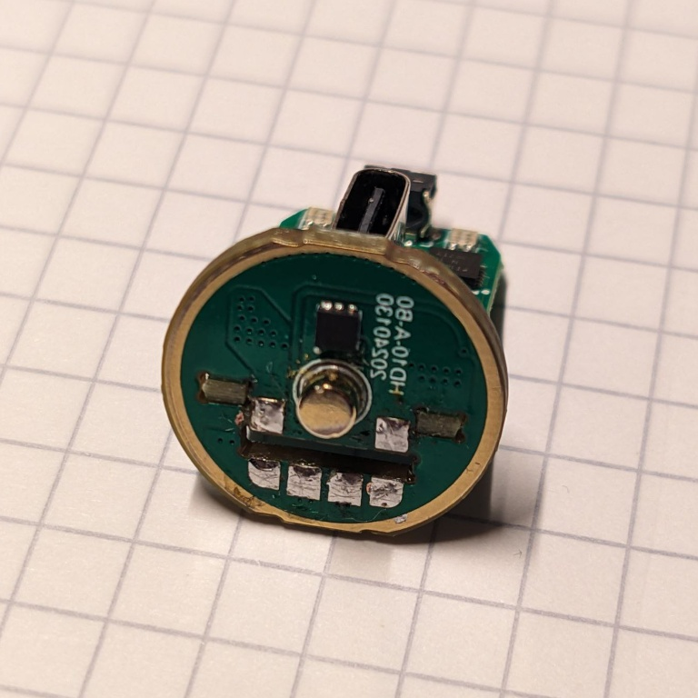
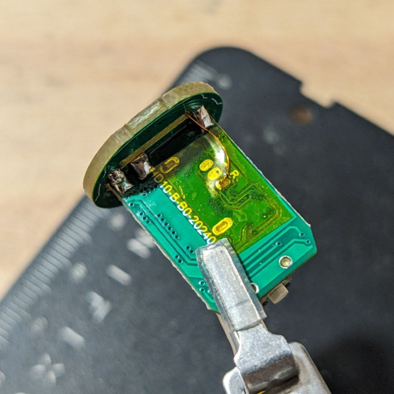
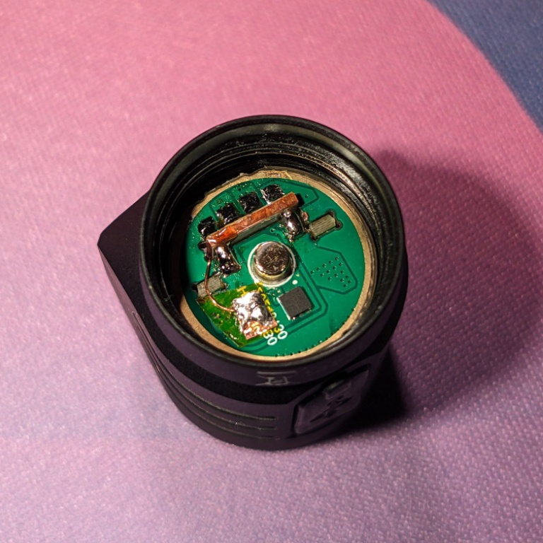
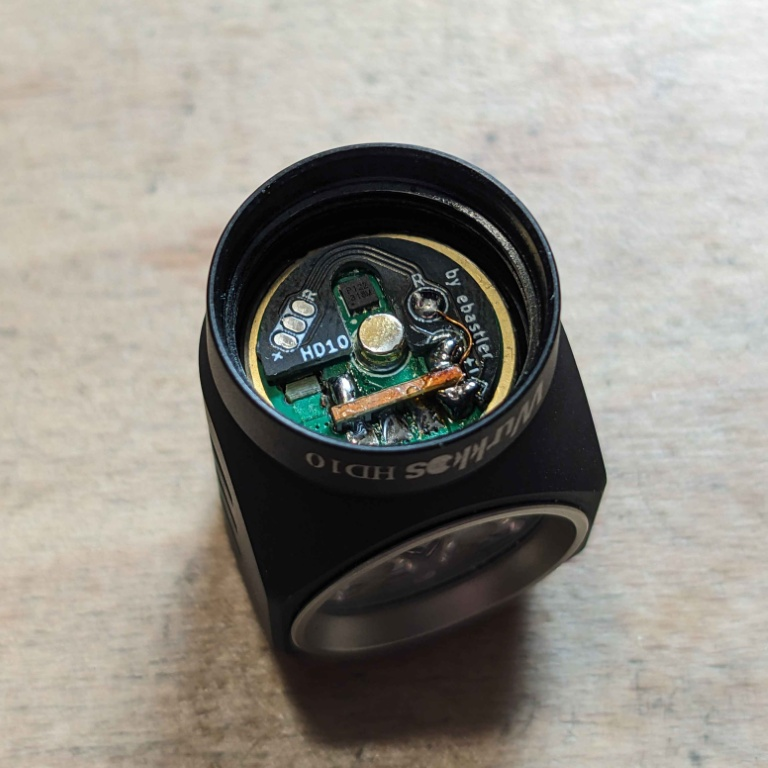

# Wurkkos HD10 flashpad adapter PCB

The Wurkkos HD10 is a compact 14500-cell powered 90° angle light running on open source Anduril firmware. The testing units and early batches, however, have the flashing pads hidden away on the inside of the light in an inaccessible spot.

## Ordering
Download the [Gerber files](./fab/HD10_flashpad.zip) from the [fab](./fab) folder and upload them at a PCB factory of your choice. Make sure you will order `0.8 mm` thick PCBs at most. I would recommend even thinner if that does not cost an excessive amount of money. The prototype pictured below is 0.8 mm and works even with flat top cells, but needs you to keep your solder joints very flat. 

PCB factories might check back because the bottom layer has no copper at all, and the PCB has no drills. I used JLCPCB and they asked about both points. Just confirm them to proceed into production - this is intentional.

## Modifying the light
I have posted a more detailed teadown [here](https://budgetlightforum.com/t/review-wurkkos-hd10-a-great-formfactor-anduril-2-90-headlamp/224176/2), so this readme will only outline the basics:

1) First you need to desolder the 6 pins connecting the LED daughterboard to the main PCB. This will allow you to carefully push the driver out of the battery tube. Desoldering pumps and solder wick are a great help for this step, and a moderately powerful soldering iron is needed. 

2) Locate the flashing pads, and solder a thin enameled wire to it. Please do not use bare copper wire (it will short the light) or regular wire (too thick). Route the wire through the hole for the LED daughterboard. This milled slot has drilled corners, which are large enough for a thin enameled wire to pass through. Cover the solder joint and wire with a bit of Kapton tape.

3) Reassemble the light, and make sure the wire stays in one of the corner drills. On the picture I soldered it to a temporary pad of copper tape on Kapton - ignore that step since you will have the PCBs already.

4) Place the PCB as shown and stick it down with a thin double sided tape. The PCB has no metal on the bottom layer, so it can not short out anything. Solder the thin wire to the `R` pad, and the `+` and `-` pads to the nearest contacts on the LED PCB. A short piece of (very) thin wire might make this easier. You might consider adding a final layer of Kapton over all exposed solder joints as a last step and make sure they are all flat enough that they do not protrude over the brass button.

| 

 | 

 |
|:----------------------------------------------------|:--------------------------------------------------------------|
|  |  |
| 1) Remove PCB from housing | 2) Solder data wire |
|  | |
| 3) Reassemble | 4) Add flashing PCB |

